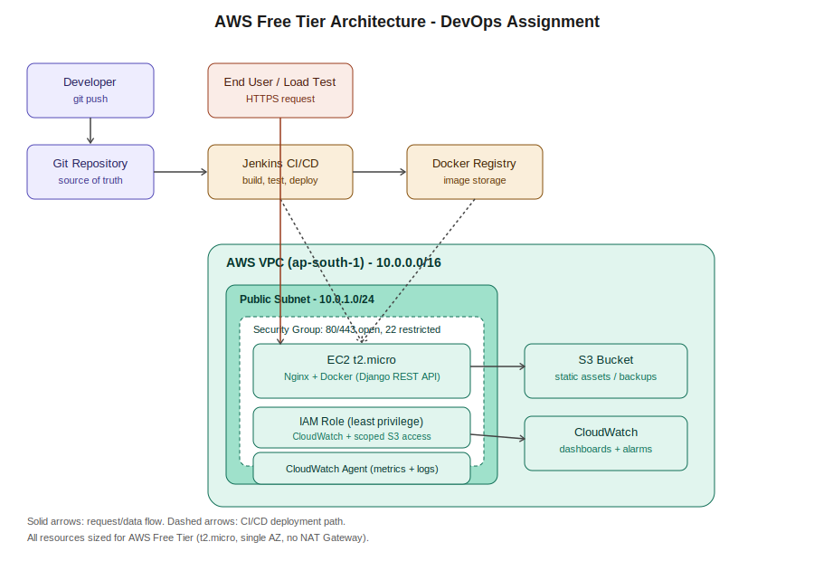

# AWS DevOps Production Pipeline

A production-like web application deployed on AWS Free Tier, built to
demonstrate end-to-end DevOps practice: infrastructure as code, containerized
deployment, CI/CD automation, security hardening, monitoring, and load
testing.

## Architecture



A single EC2 instance (t2.micro, Free Tier) sits in a public subnet inside a
dedicated VPC. Docker runs the Django REST API behind Nginx. An IAM role
(least privilege) lets the instance write logs/metrics to CloudWatch and
read/write only its own S3 bucket. A Jenkins pipeline builds, tests, and
deploys on every push. See `docs/ARCHITECTURE.md` for the full breakdown.

## What this project does
This repo provisions and deploys a Django REST API on AWS, covering the full
lifecycle a DevOps engineer is responsible for:

- **Infrastructure as Code** — a complete AWS environment (VPC, subnet,
  security groups, EC2 instance, S3 bucket, IAM role) is provisioned
  entirely through Terraform, not clicked together manually.
- **Containerized application** — the API runs in Docker, served through
  an Nginx reverse proxy, so it behaves like a real production deployment
  rather than a bare script.
- **Security by design** — IAM permissions are scoped to least privilege
  (no wildcard access), SSH is restricted to a single admin IP, and the S3
  bucket blocks all public access.
- **Monitoring** — a CloudWatch agent on the EC2 instance streams CPU,
  memory, and log data back to AWS, with alarms configured for high CPU,
  high memory, and instance health check failures.
- **Load testing** — a k6 script simulates ramping traffic (0 → 50
  concurrent users) against the live API, achieving 120.91ms p95 latency
  and 0% error rate at peak load.
- **CI/CD** — a Jenkins pipeline automates build, test, image push, and
  deployment on every code change.

## Tech stack
Terraform · AWS (EC2, VPC, IAM, S3, CloudWatch) · Docker · Nginx ·
Django REST Framework · Jenkins · k6

## Live deployment
- API health check: `http://13.206.32.62/api/health/`
- Region: `ap-south-1` (Mumbai)

## Load test results (50 concurrent users, 9-minute ramp)
| Metric | Value |
|---|---|
| p95 latency | 120.91ms |
| Avg response time | 67.07ms |
| Throughput | 29.08 req/s |
| Error rate | 0.00% |
| Total requests | 15,724 |

## Repo structure
## How it was built
1. Provisioned networking and compute with Terraform (`terraform/`)
2. Built and containerized the Django REST API (`app/`)
3. Deployed the container to EC2 via Docker Compose behind Nginx
4. Installed and configured the CloudWatch agent for metrics + log
   collection, then created alarms for CPU, memory, and instance health
5. Ran k6 load tests against the live `/api/health/` endpoint to capture
   performance data under increasing concurrent load
6. Automated the build-test-deploy cycle with a Jenkins pipeline

See `docs/DEPLOYMENT_GUIDE.md` for the exact step-by-step commands, and
`docs/ARCHITECTURE.md` for a written breakdown of the diagram above.

## Quick start
```bash
cd terraform
terraform init
terraform apply -var="key_name=<your-key>" -var="my_ip=<your-ip>/32"
```

## Deliverables
- [x] Git repository (this repo)
- [x] Deployment guide — `docs/DEPLOYMENT_GUIDE.md`
- [x] Architecture diagram — `docs/architecture.svg`
- [x] Pipeline configuration — `jenkins/Jenkinsfile`
- [x] Security summary — `docs/SECURITY_SUMMARY.md`
- [x] Monitoring (CloudWatch agent + alarms) — live and verified
- [x] Load testing report with graphs — see results above
- [ ] 5–10 min demo video
- [ ] Final report (PDF/DOCX) — `docs/FINAL_REPORT_TEMPLATE.md`
